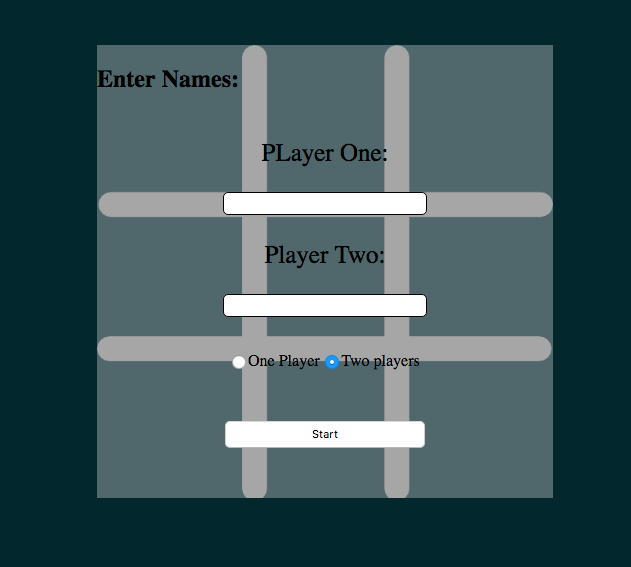

# Tic Tac Toe

## Game Description

Xs and Os, is a paper-and-pencil game for two players, X and O, who take turns marking the spaces in a 3×3 grid. The player who succeeds in placing three of their marks in a horizontal, vertical, or diagonal row wins the game.

## Screenshots Of The Game




## The Logic Of The Game

I use for loops and arrays to find the right pattern of wins.

I defiend all the possible patterns of win in an array like this:

```
let winPattrens = [
  ["1", "2", "3"],
  ["4", "5", "6"],
  ["7", "8", "9"],
  ["1", "4", "7"],
  ["2", "5", "8"],
  ["3", "6", "9"],
  ["1", "5", "9"],
  ["3", "5", "7"]
];
```

then I use loops and ifs to return the right pattern

```
function checkWin(playerStack) {
  let match = 0;
  for (let win of winPattrens) {
    for (let i = 0; i < playerStack.length; i++) {
      if (win.includes(playerStack[i])) {
        match++;
        if (match === 3) {
          gameOver = true;
          return true;
        }
      }
    }
    match = 0;
  }
}
```

## The Difficult Part Of The Project

Makeing the AI unbeatable and it was the most fun part too

## Upcoming Features

making the game online using firebase.

## Acknowledgements

Thanks for everyone in the class of **GA-WDI** and especially <br />
**[Moath](https://github.com/mfalthaw)** <br />
**[MicFin](https://github.com/MicFin)** <br />
**[Usman Bashir](https://github.com/usmanbashir)**
